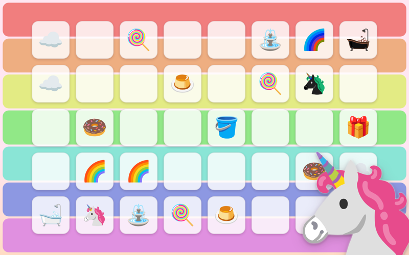

# 🦄 Empire of Sugar 🌈

My entry for [js13kGames](https://js13kgames.com/) 2026. This year's theme is
*Unicorns and Rainbows*, and everything fits into a 13,312-byte zip.

[](https://mxlle.github.io/13k-2026-unicorns-and-rainbows/)

**▶️ [Play it here](https://mxlle.github.io/13k-2026-unicorns-and-rainbows/)**: the
friends-&-family build, deployed to GitHub Pages from `main` on every push.

## The game

*You start with one unicorn, a bathtub in the corner, and no idea what is out there.*

A turn-based game of light and sugar on a board hidden under clouds. Line a unicorn up with a
fountain or a lollipop to cast a rainbow, clear the fog, and balance your two incomes: a rainbow
cast through a ⛲ pays 💧 for your steps, one cast through a 🍭 pays 🍬 for new unicorns. Get as
far up the ladder of seven boards as you can, from a two-turn tutorial to a
25×25. From the fifth board on there is a rival: a dark unicorn from the opposite corner, played
by the game's own bot.

It is explained in-game, so jump right in. [`DESCRIPTION.md`](DESCRIPTION.md) is the submission
text, with hints and spoilers at the bottom if you get stuck.

## Getting started

Requires Node.js ^20.19 or >=22.12.

```sh
npm install
npm start                       # dev server
npm run build-js13k-roadroller  # competition zip + size report
```

The competition zip is the Roadroller-packed one, because the entry no longer fits without that
crunch. `npm run build-js13k` builds the same thing un-packed: faster and readable, but over the
limit.

There are three build modes: the competition build, the "friends & family" build
(`npm run build`, what GitHub Pages serves, with extra languages, nice-to-have visuals and a PWA
manifest), and a Poki build (`npm run build-poki`). Everything the first one does without is
behind a compile-time flag in `src/env-utils.ts` and tree-shaken out, so the extras cost the
13 kB entry nothing.

There are also headless tools for balancing: `npm run bot` plays whole runs with nobody
watching, `npm run sweep` tunes the bot's weights over a grid, and `npm run levels` measures the
seven curated levels. `npm run typecheck` and `npm run lint` are what CI gates on, alongside
`prettier --check` and the 13 kB limit itself.

## Documentation

[`CLAUDE.md`](CLAUDE.md) is the manual, for humans and AI agents alike: it explains the size
machinery (enum inlining, the enum-map transformer, property mangling and the rules it imposes,
CSS class name syncing), the bot and the opponent, and the byte-golfing guidelines distilled from
previous entries. **Read it before touching `vite.config.ts` or adding an enum.**

## 🤖 On the use of AI

A deliberate split of roles. Every design decision (ideas, theme, mechanics, economy, balancing)
and the template from my 2025 entry are mine; the implementation, the byte-golfing and the bot I
balanced against are Claude Code's. Open questions came to me, not the AI.

## Licensing

MIT-licensed (see `LICENSE`).

One third-party component: the audio players in `src/audio/small-player*.ts` are modified versions
of `player-small.js` from [SoundBox](https://sb.bitsnbites.eu/) by Marcus Geelnard, under the
[zlib license](https://opensource.org/licenses/Zlib) (kept in the file headers, so please don't
remove it). Note that the SoundBox *editor* itself is GPLv3, but the exported player routine and
your own exported songs are not affected by that.
